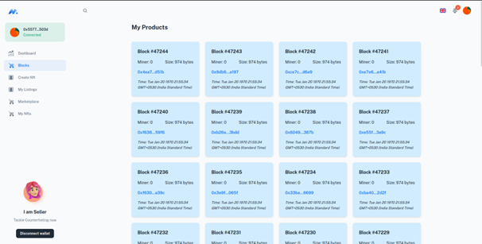

# Dapp Chain (HAS-Chain)

This project aims to combat product counterfeiting while conducting a comprehensive assessment of the Proof-of-Work (PoW) algorithm employed in a private Layer 2 (L2) blockchain network. Using blockchain and NFTs on a custom Ethereum L2 chain, the initiative fights counterfeit products. The core focus is on assessing the NFT platform and the robustness of the underlying blockchain system. "Hardness," in this context, refers to the computational difficulty of solving mathematical puzzles necessary for mining new blocks and validating transactions on the network.

## Table of Contents

1. [Introduction](#introduction)
2. [Tech Stack](#tech-stack)
3. [Prerequisites](#prerequisites)
4. [Methodology](#methodology)
   - [HAS Chain Overview](#has-chain-overview)
   - [Communication with Boot Nodes](#communication-with-boot-nodes)
   - [JSON-RPC & MetaMask](#json-rpc--metamask)
   - [NFTs & Marketplace Flow](#nfts--marketplace-flow)
   - [Assessment Framework & Algorithm](#assessment-framework--algorithm)
5. [Setup Instructions](#setup-instructions)
   - [Step 1: Create Nodes Directory](#step-1-create-nodes-directory)
   - [Step 2: Initialize Secrets](#step-2-initialize-secrets)
   - [Step 3: Create Additional Chains](#step-3-create-additional-chains)
   - [Step 4: Generate Genesis Block and Bootnodes](#step-4-generate-genesis-block-and-bootnodes)
   - [Step 5: Start Nodes](#step-5-start-nodes)
   - [Step 6: Verify Connection](#step-6-verify-connection)
6. [Notes](#notes)
7. [Images & Screenshots](#images--screenshots)
8. [Conclusion](#conclusion)

---

## Introduction

In an era where counterfeit goods threaten business integrity and consumer trust, and concerns about the sustainability of energy-intensive Proof of Work (PoW) blockchain networks persist, our capstone project offers a unified, innovative solution. Built on Ethereum's architecture, our blockchain system empowers businesses, particularly SMEs, with a robust, fee-free anti-counterfeiting mechanism. This leverages blockchain's transparency and untraceability to independently verify product authenticity. At the same time, we address PoW sustainability concerns through a comprehensive assessment framework analyzing carbon footprint, CPU temperature, memory usage, GPU core utilization, and scalability. By tackling these challenges, we aim to mitigate counterfeit threats and advance a more sustainable, resource-efficient blockchain framework that fosters trust, innovation, and responsible technology development.

---

## Tech Stack

This project is built using the following technologies:

- **Figma**: For UI/UX design and prototyping.
- **React.js**: Frontend library for building the user interface.
- **Polygon Edge**: Blockchain framework to deploy the Ethereum-based private chain.
- **Node.js**: JavaScript runtime environment for server-side scripting.
- **Express**: Web framework for Node.js to build API endpoints and handle HTTP requests.
- **Docker**: Containerization platform for building, running, and managing containers.
- **Ubuntu**: Operating system for development and deployment.
- **Go**: Programming language used for developing the blockchain network.
- **NVIDIA GPU**: Graphics Processing Unit for enhancing mining performance and computational tasks.
- **Solidity**: Smart contract programming language used for building decentralized applications (dApps).
- **Swagger**: API documentation tool to create, document, and test APIs.
- **TypeScript**: A statically typed superset of JavaScript used for building large-scale applications.
- **MetaMask**: Crypto wallet and browser extension for interacting with the Ethereum blockchain.

---

## Prerequisites

Before starting, make sure you have **Polygon-Edge** installed on your system.

---

## Methodology

### HAS Chain Overview

To create a custom blockchain network, we used **Polygon-Edge** technology to deploy nodes across different devices. We set up two types of nodes:

1. **Bootstrap Nodes** (also called boot nodes): These nodes facilitate the creation of the network and act as the entry points for new nodes joining the system. Boot nodes not only form the peer-to-peer network but can also create individual chains when initialized in isolation.

2. **Miner Nodes**: These nodes are responsible for mining the blocks with a linear increment in difficulty level. Miner nodes ensure the ongoing creation and validation of new blocks on the blockchain.

---

### Communication with Boot Nodes

We utilized the **gRPC** protocol for communication between nodes. This protocol is well-suited for low-latency, high-performance communication, allowing for efficient block propagation and miner coordination. The **PolyBFT** consensus algorithm was used to improve the efficiency, stability, and security of mining nodes:

- **Efficiency Boost**: Optimizes resource usage.
- **Stability Enhancement**: Ensures smooth node operations under various conditions.
- **Optimized Resource Utilization**: Ensures minimal resource waste.
- **Secure and Trustworthy**: Facilitates secure communication and transactions.

---

### JSON-RPC & MetaMask

**JSON-RPC** is used for remote procedure calls (RPCs) between the dApp and blockchain nodes. It allows MetaMask to interact with our blockchain network, where it relays requests to the appropriate nodes and handles blockchain transactions.

1. The **NFT Marketplace dApp** sends JSON-RPC requests to MetaMask.
2. MetaMask forwards these requests to the correct node (e.g., has-node-1, has-node-2) on the specified ports (e.g., 10001, 20002).
3. The blockchain node processes the request and sends the response back through MetaMask.
4. MetaMask delivers the response to the dApp, enabling seamless interaction.

**MetaMask** acts as a wallet and provider that connects the **NFT marketplace** to the blockchain, allowing users to perform transactions like minting and purchasing NFTs.

---

### NFTs & Marketplace Flow

1. **Users**: Either the buyer or seller (artisan or marketplace visitor).
2. **MetaMask**: The user authorizes their wallet and joins the dApp marketplace.
3. **NFT Minting**: The artisan uploads an image of their artwork, adds a title, description, and price, then mints it as an NFT.
4. **Storing Media**: The artwork is stored off-chain on the **InterPlanetary File System (IPFS)**, and only the metadata (name, description, price) is stored on the blockchain.
5. **NFT Marketplace**: The **Smart Contract** on the marketplace facilitates the buying and selling of NFTs between the artist and the buyer.
6. **ERC721 Smart Contract**: The metadata is used to create a token on the **ERC721** Smart Contract, ensuring each NFT is unique and non-replicable.
7. **Miner & Bootstrap Nodes**: Miner and bootstrap nodes validate the NFT transaction on the blockchain. Miner nodes process the transaction and add new blocks to the blockchain, while bootstrap nodes help new nodes connect to the network.

---

### Assessment Framework & Algorithm

As the NFT marketplace scales, we assess the environmental impact of increased user activity by examining system metrics such as CPU utilization, memory usage, GPU utilization, and carbon footprint during mining. We provide a **baseline assessment framework** to help organizations measure the sustainability of their blockchain infrastructure.

We forked the cryptographic algorithm of the blockchain and ran it locally to understand its system hardness. The system metrics analyzed include CPU utilization, RAM usage, GPU CUDA core utilization, and swap space utilization.

---

### Algorithm Used in Assessment Framework

The **Proof of Work (PoW)** consensus algorithm is implemented using the **Ethash JavaScript implementation**. This allows us to simulate block mining under different difficulty levels and block numbers:

- Ethash simulates a real chain and mines blocks based on the user-defined difficulty level.
- We avoid full consensus validation during testing and focus on system performance metrics.

---

## Setup Instructions

### Step 1: Create Nodes Directory

Create a directory named `dapp-chain` to store all the nodes.

```bash
mkdir dapp-chain
```

### Step 2: Initialize Secrets

Run the following command to initialize secrets for your first chain (replace `has-chain-1` with your preferred chain name).

```bash
polygon-edge secrets init --data-dir has-chain-1 --insecure
```

#### Output:

```
[WARNING: INSECURE LOCAL SECRETS - SHOULD NOT BE RUN IN PRODUCTION]

[SECRETS INIT]
Public key (address) = 0x2e74FF80f62652515443e4c64cC7bdc79A8BbBE8
BLS Public key = 0x812c3a6b6c3139ec555c8643443a06ebf7b687433382f1f39acf13d96d179b7c3b656e91305d50451c2b735bd126b4b8
Node ID = 16Uiu2HAm546wDQej3oGL8ec8yvEFvN6hhoCK9rtfoWQazQutCH3y

[WARNING: INSECURE LOCAL SECRETS - SHOULD NOT BE RUN IN PRODUCTION]
```

Make sure to **copy** the generated **public key**, **BLS public key**, and **Node ID** for future reference.

### Step 3: Create Additional Chains

Repeat the secrets initialization step for additional chains (replace `has-chain-n` with your desired chain names, where `n` can be 2, 3, 4,

 etc.).

```bash
polygon-edge secrets init --data-dir has-chain-2 --insecure
polygon-edge secrets init --data-dir has-chain-3 --insecure
polygon-edge secrets init --data-dir has-chain-4 --insecure
```

### Step 4: Generate Genesis Block and Bootnodes

Run the following command to generate the genesis block and bootnodes configuration. Customize the `--premine` address and amount as per your needs.

```bash
polygon-edge genesis --consensus ibft --ibft-validators-prefix-path has-chain- --bootnode /ip4/127.0.0.1/tcp/10001/p2p/16Uiu2HAkvwvxei2xwymMfrUpgKud6SGff23ZWWQ7N92xWb9uotUP --bootnode /ip4/127.0.0.1/tcp/20001/p2p/16Uiu2HAmRD3MDmxB7aJPfBdkEjyGBgwjnmNj2vXbriZwPeFCP6ErP --premine=0x370e221F02A76c8F4C76d3E72cFF8c6f91888fe8:1000000000000000000
```

#### Output:

```
[GENESIS SUCCESS]

Genesis written to ./genesis.json
```

### Step 5: Start Nodes

Open multiple terminals (one for each node) and run the following commands (replace `n` with 1, 2, 3, and 4 for each respective chain):

```bash
polygon-edge server --data-dir ./has-chain-1 --chain genesis.json --grpc-address :10000 --libp2p :10001 --jsonrpc :10002 --seal --log-level DEBUG
polygon-edge server --data-dir ./has-chain-2 --chain genesis.json --grpc-address :20000 --libp2p :20001 --jsonrpc :20002 --seal --log-level DEBUG
polygon-edge server --data-dir ./has-chain-3 --chain genesis.json --grpc-address :30000 --libp2p :30001 --jsonrpc :30002 --seal --log-level DEBUG
polygon-edge server --data-dir ./has-chain-4 --chain genesis.json --grpc-address :40000 --libp2p :40001 --jsonrpc :40002 --seal --log-level DEBUG
```

#### Example Output (Partial):

```
2023-10-12T16:53:23.033+0530 [INFO]  polygon.server.jsonrpc: http server started: addr=0.0.0.0:40002
2023-10-12T16:53:23.033+0530 [INFO]  polygon.server.ibft.consensus: sequence started: height=1
2023-10-12T16:53:23.033+0530 [INFO]  polygon.server.ibft.consensus: round started: round=0
...
Peer connected: id=16Uiu2HAm546wDQej3oGL8ec8yvEFvN6hhoCK9rtfoWQazQutCH3y
Peer connected: id=16Uiu2HAm6UvWR8Q81xypFL7YfUdiZYzrczgtj9usL7RkU8x5nmD9
...
```

### Step 6: Verify Connection

Check the terminals for **peer connection** messages to ensure that the nodes are connected successfully.

---

## Notes

- This setup is for **testing** purposes and should **not** be used in a production environment.
- Customize chain names, ports, and addresses according to your specific use case.
- Ensure your system meets the requirements for **Polygon-Edge**.

---

## Images & Screenshots

1. **Dashboard**

   
   
2. **Blocks Mined**

   
   
3. **Block Details**

   
   
4. **NFT Marketplace**

   
   
5. **Running ETH Hash Algorithm**

   

---

## Conclusion

This project investigated the sustainability of **Proof-of-Work (PoW)** algorithms deployed in public blockchain networks. By analyzing factors such as CPU temperature, memory usage, swap memory usage, GPU core utilization, and scalability limitations, this study provided insights into the system implications and operational efficiency of PoW-based systems.

The findings are expected to contribute to a more comprehensive understanding of the trade-offs between system hardness and sustainability inherent to PoW blockchains. This knowledge will be instrumental in the development of future blockchain technologies striving for a balance between robust security and reduced environmental impact.

Our contributions resonate with **SDGs 9, 12, 13, and 16**, emphasizing the societal significance of this work. By tackling infrastructure challenges, responsible consumption, production, and climate action, this research propels blockchain technology toward security, efficiency, and a reduced environmental impact.

